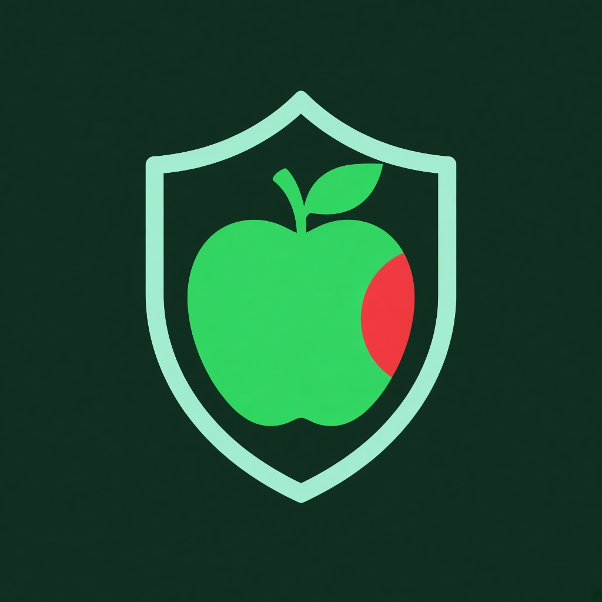
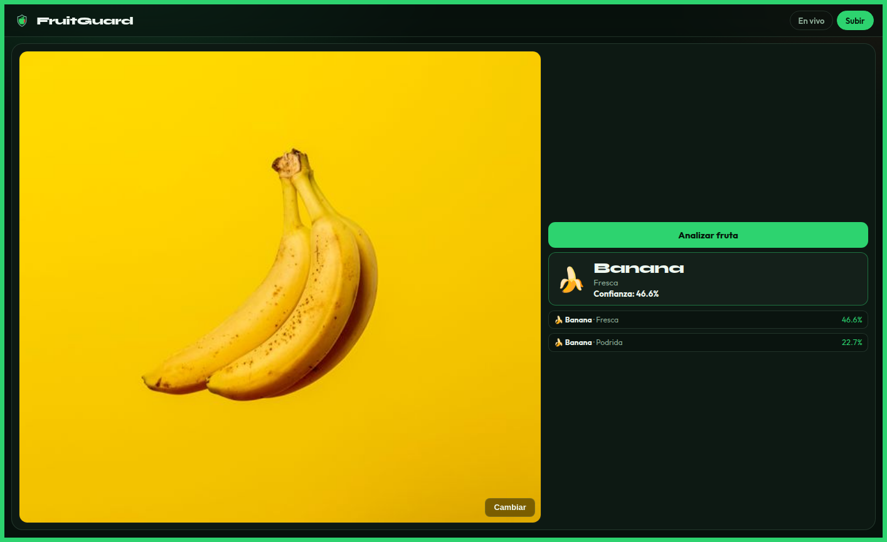

<a id="readme-top"></a>
<!-- SHIELDS -->

<p align='center'> 
  &nbsp;
  &nbsp;
  &nbsp;
  &nbsp;
</p>

<!-- PROJECT LOGO -->
<br>
<div align="center">
   
   <h3 align="center">🍎 FruitGuard</h3>
   <p align="center">
     Clasificador inteligente de frutas y frescura en tiempo real
     <br>
     <a href="https://github.com/hexed-AAL1X/FruitGuard"><strong>Explore the docs »</strong></a>
     <br>
     <br>
     <a href="https://github.com/hexed-AAL1X/FruitGuard">View Demo</a>
     ·
     <a href="https://github.com/hexed-AAL1X/FruitGuard/issues/new?labels=bug">Report Bug</a>
     ·
     <a href="https://github.com/hexed-AAL1X/FruitGuard/issues/new?labels=enhancement">Request Feature</a>
   </p>
</div>

<!-- TABLE OF CONTENTS -->
<details>
  <summary>Table of Contents</summary>
  <ol>
    <li>
      <a href="#about-the-project">About The Project</a>
      <ul>
        <li><a href="#built-with">Built With</a></li>
      </ul>
    </li>
    <li><a href="#important-notices">Important Notices</a></li>
    <li><a href="#datasets">Datasets</a></li>
    <li>
      <a href="#getting-started">Getting Started</a>
      <ul>
        <li><a href="#prerequisites">Prerequisites</a></li>
        <li><a href="#installation">Installation</a></li>
      </ul>
    </li>
    <li>
      <a href="#contributing">Contributing</a>
      <ul>
        <li><a href="#top-contributors">Top Contributors</a></li>
      </ul>
    </li>
    <li><a href="#contact">Contact</a></li>
  </ol>
</details>
<br>

<!-- ABOUT THE PROJECT -->
<a id="about-the-project"></a>***About The Project***


<div align="center">
  
  <p><em>Captura real de la app: banana clasificada como fresca</em></p>
</div>

**FruitGuard** es un sistema de control de calidad alimentaria que clasifica frutas/verduras por **tipo** y **estado** (fresca o podrida) a partir de imágenes, con cámara en vivo o foto subida.

Nació para reemplazar la inspección manual —lenta y subjetiva— con un pipeline de visión por computadora usable en condiciones reales (mesa, fondos variados, varias piezas).

Here's why:

* Detecta en **tiempo real** desde la webcam o desde una imagen.
* Usa un **CNN (MobileNetV3 → ONNX)** entrenado con Freshness44 + ensemble en inferencia.
* Backend **FastAPI** + frontend web (sin Gradio).
* Pensado para desplegarse en un solo servicio (p. ej. Render).

<a id="built-with"></a>
### Built With
* &nbsp;
* &nbsp;
* &nbsp;
* &nbsp;
* &nbsp;
* &nbsp;
* &nbsp;
<p align="right">(<a href="#readme-top">back to top</a>)</p>

<!-- IMPORTANT NOTICES -->
<a id="important-notices"></a>***Important Notices***


> [!NOTE]  
> Para instalar y ejecutar FruitGuard necesitas:

> | Requirement | Description |
> |-------------|-------------|
> | Python |  |
> | API |  |
> | ML |  |

> [!IMPORTANT]  
> El modelo ya viene entrenado en `backend/models/fruit_cnn.onnx`. **No hace falta** el dataset para usar la app; solo si quieres reentrenar.

> [!WARNING]  
> No es un modelo tipo GPT/Gemini: puede fallar en fotos difíciles (pantallas, fondos raros, clases muy parecidas). Sigue mejorando con priors + ensemble.
<p align="right">(<a href="#readme-top">back to top</a>)</p>

<!-- DATASETS -->
<a id="datasets"></a>***Datasets***


Créditos a los autores de los datasets públicos usados para entrenar / prototipar:

| Dataset | Autor | Uso | Enlace |
|---------|--------|-----|--------|
| **Freshness44** | [siavash93](https://www.kaggle.com/siavash93) | Entrenamiento principal del CNN (~53k imágenes, fresh/rotten, fondos variados) | [Kaggle · Freshness44](https://www.kaggle.com/datasets/siavash93/freshness44) |
| **Fresh and Stale Classification** | [swoyam2609](https://www.kaggle.com/swoyam2609) | Prototipo inicial fresca/podrida | [Kaggle · Fresh and Stale](https://www.kaggle.com/datasets/swoyam2609/fresh-and-stale-classification) |

> Los datasets **no** se incluyen en este repo. Descárgalos en Kaggle si reentrenas y respeta su licencia.
<p align="right">(<a href="#readme-top">back to top</a>)</p>

<!-- GETTING STARTED -->
<a id="getting-started"></a>***Getting Started***


Instrucciones para levantar FruitGuard en local.

<a id="prerequisites"></a>
### Prerequisites
* Python **3.10+**
* `pip` / `venv`
* Cámara (opcional, para modo en vivo)

<a id="installation"></a>
### Installation

1. Clona el repositorio
   ```sh
   git clone https://github.com/hexed-AAL1X/FruitGuard.git
   ```
2. Entra al proyecto
   ```sh
   cd FruitGuard
   ```
3. Crea el entorno e instala dependencias
   ```sh
   cd backend
   python -m venv .venv
   source .venv/bin/activate   # Windows: .venv\Scripts\activate
   pip install -r requirements.txt
   ```
4. Arranca la API (también sirve el frontend)
   ```sh
   uvicorn main:app --host 0.0.0.0 --port 8000
   ```
5. Abre la app
   - App: http://127.0.0.1:8000/app/
   - Docs: http://127.0.0.1:8000/docs

#### Estructura

```
FruitGuard/
├── backend/          # FastAPI + CNN
│   └── models/fruit_cnn.onnx
├── frontend/         # UI web
├── assets/images/    # Logo README
└── README.md
```
<p align="right">(<a href="#readme-top">back to top</a>)</p>

<!-- CONTRIBUTING -->
<a id="contributing"></a>***Contributing***


Las contribuciones hacen grande al open source. ¡Cualquier PR es bienvenida!

1. Fork del proyecto
2. Crea una rama (`git checkout -b feature/Mejora`)
3. Commit (`git commit -m 'Add Mejora'`)
4. Push (`git push origin feature/Mejora`)
5. Abre un Pull Request

<a id="top-contributors"></a>
### Top contributors

<div align="center">

<table>
  <tr>
    <td align="center" width="160">
      <a href="https://github.com/ZtanQ">
        <br />
        <b>Gabriel Reyna</b><br />
        <sub>@ZtanQ</sub>
      </a>
    </td>
    <td align="center" width="160">
      <a href="https://github.com/Dreelliot">
        <br />
        <b>André Elliot</b><br />
        <sub>@Dreelliot</sub>
      </a>
    </td>
  </tr>
</table>

</div>
<p align="right">(<a href="#readme-top">back to top</a>)</p>

<!-- CONTACT -->
<a id="contact"></a>***Contact***

<p align="center">
  <a href="mailto:hexed_aal1x.ops@proton.me"></a>
  <a href="https://www.instagram.com/hexed_aal1x"></a>
  <a href="https://www.linkedin.com/in/leonardo-bravo-4120b8228/"></a>
</p>
<p align="right">(<a href="#readme-top">back to top</a>)</p>
